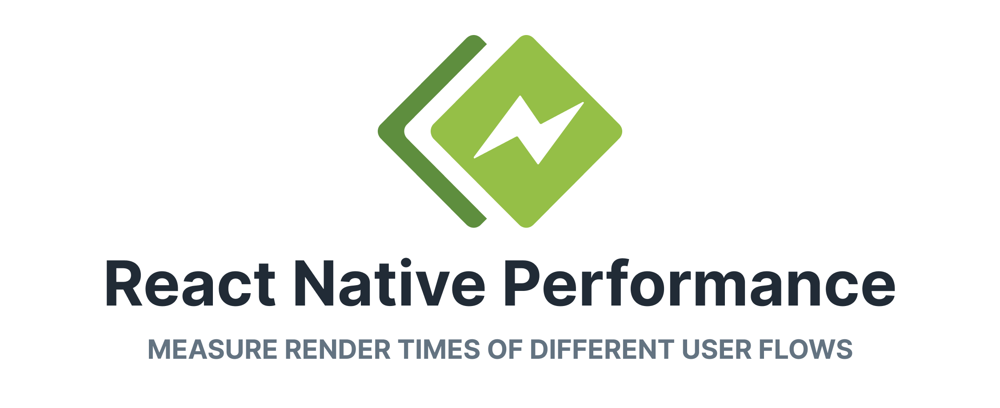

<!-- THIS FILE IS AUTOGENERATED SO DON'T EDIT IT DIRECTLY -->
<!-- EDIT "templates/README_ROOT.hbs.md" and run 'yarn generate readme' -->

  

# @shopify/react-native-performance

Performance measurement for your React Native apps.

Documentation can be found at [shopify.github.io/react-native-performance](https://shopify.github.io/react-native-performance/)

---

[Installation](#install-⬇️) | [Packages](#packages) | [Playground app](#playground-app) | [Contributing](#contributing)

## Install

Add the package to your project _(i.e. `yarn add xxx`)_,
and run `pod install` in the `ios` directory.
Packages are set up to be compatible with [autolinking](https://github.com/react-native-community/cli/blob/main/docs/autolinking.md).

## Package Versions

| Name | Version |
| ---- | ------- |
| [@shopify/flipper-plugin-shopify-react-native-performance](/packages/flipper-plugin-react-native-performance) | [2.0.0](https://github.com/Shopify/react-native-performance/releases/tag/flipper-plugin-shopify-react-native-performance%402.0.0) |
| [@shopify/react-native-performance](/packages/react-native-performance) | [4.1.2](https://github.com/Shopify/react-native-performance/releases/tag/%40shopify%2Freact-native-performance%404.1.2) |
| [@shopify/react-native-performance-lists-profiler](/packages/react-native-performance-lists-profiler) | [1.1.0](https://github.com/Shopify/react-native-performance/releases/tag/%40shopify%2Freact-native-performance-lists-profiler%401.1.0) |
| [@shopify/react-native-performance-navigation](/packages/react-native-performance-navigation) | [3.0.0](https://github.com/Shopify/react-native-performance/releases/tag/%40shopify%2Freact-native-performance-navigation%403.0.0) |
| [@shopify/react-native-performance-navigation-bottom-tabs](/packages/react-native-performance-navigation-bottom-tabs) | [3.0.0](https://github.com/Shopify/react-native-performance/releases/tag/%40shopify%2Freact-native-performance-navigation-bottom-tabs%403.0.0) |
| [@shopify/react-native-performance-navigation-drawer](/packages/react-native-performance-navigation-drawer) | [3.0.0](https://github.com/Shopify/react-native-performance/releases/tag/%40shopify%2Freact-native-performance-navigation-drawer%403.0.0) |

## Playground app

The [fixture](/fixture) directory contains a native iOS and Android project with a suite of tests for the native code of the packages, and an example app showing how to use each of the packages.

To run the app locally:

- `yarn up`
- `yarn ios` or `yarn android` to launch iOS or Android app.

## Contributing

See the [contributing guide](./CONTRIBUTING.md) to learn how to contribute to the repository and the development workflow.

## License

MIT
