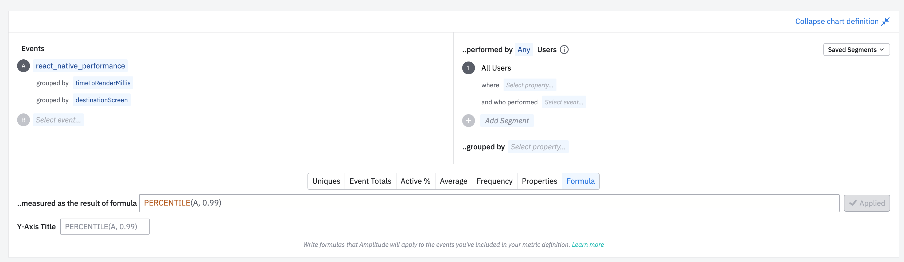
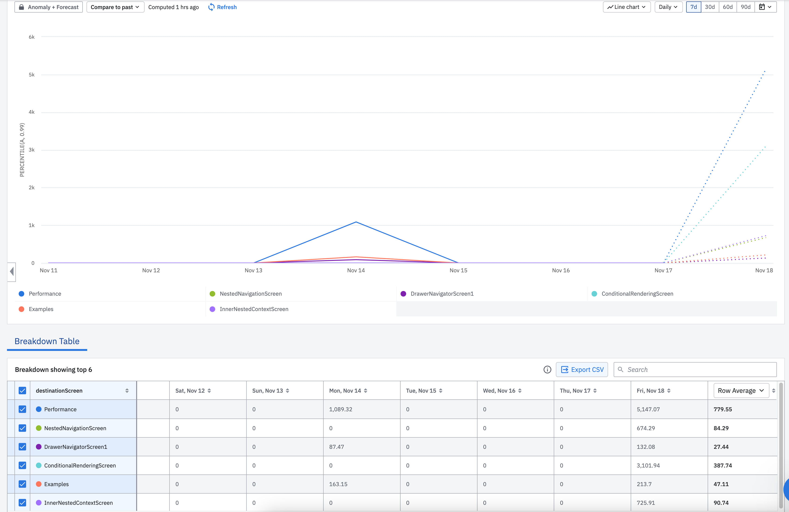

As was mentioned in [Render Pass Reports](./../fundamentals/render-pass-report.md) chapter, every time a profiled screen is rendered, the library emits a `RenderPassReport` object that can be accessed in the `onReportPrepared` callback of the `PerformanceProfiler` component. Through this callback, one can report the reports to a telemetry service. On this page, we will see an example of how to send `Render Pass Reports` to [Amplitude.](https://amplitude.com/)

## Amplitude

After integrating [Amplitude React Native SDK](https://www.docs.developers.amplitude.com/data/sdks/typescript-react-native/), you only need one line to pass the event from onReportPrepared callback to Amplitude:

``` tsx
import {PerformanceProfiler, LogLevel} from '@shopify/react-native-performance';
import {track} from '@amplitude/analytics-react-native';


const App = () => {
...
  return (
    ...
      <PerformanceProfiler
        logLevel={LogLevel.Debug}
        onReportPrepared={report =>
            track('react_native_performance', report)
         }>
      </PerformanceProfiler>
    </>
  );
};

export default App;
```

Once you’ve got the events on your dashboard, you can set the monitoring to show how your screens perform with the time. There is also a possibility to add a breakdown of rendering steps and how long they took to make it easier to identify the bottlenecks.






Here is an example of an Amplitude dashboard that shows us the rendering time per screen with the time. This dashboard uses events sent by a demo project that you can check out in [react-native-performance-reporting-demo](https://github.com/ElviraBurchik/react-native-performance-reporting-demo) repo.
